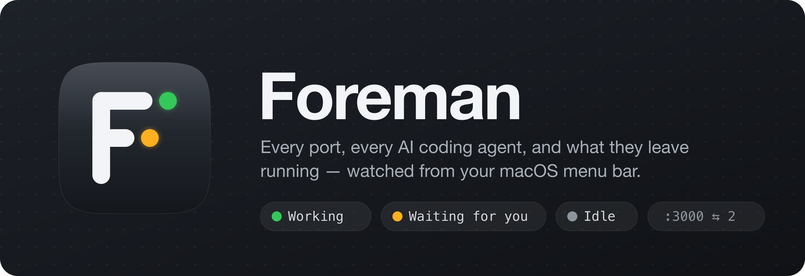

<p align="center"></p>

# Foreman

**A macOS menu bar foreman for your dev machine.** One panel shows every listening port, every AI coding agent, and what they left running — and lets you stop, pause, clean up or jump to any of it.

- **Ports** — every listening TCP port with its process, project, framework (Next.js, Vite, Django…), git branch, CPU and RAM — and the Docker / OrbStack containers behind published ports. Stop anything in one click.
- **Agents** — Claude Code, Codex, Cursor Agent, Gemini CLI, Aider, opencode, Goose and Amp sessions, with live status (working / waiting for you / idle), task title, process-tree CPU and RAM, and today's tokens and cost. Pause, stop, or jump straight to the agent's terminal tab.
- **Usage** — today's Claude tokens with their API-price equivalent, Codex tokens, and Codex's 5-hour and weekly limits.
- **Keep awake** — the Mac doesn't idle-sleep while an agent is still working.
- **Notifications** — know when an agent finishes a task or needs your answer, without watching every tab.
- **Housekeeping** — spots dev servers left behind by closed terminals, removed worktrees or long-idle sessions, and cleans them up after you confirm.

Available in **English** (default) and **Vietnamese** — switch in Settings → General → Language. Personal-use tool: non-sandboxed, ad-hoc signed, not on the App Store.

---

## Contents
- [Install](#install)
- [First run](#first-run)
- [Using Foreman](#using-foreman)
- [Notifications and hooks](#notifications-and-hooks)
- [Settings](#settings)
- [What Foreman will never do](#what-foreman-will-never-do)
- [How it works](#how-it-works)
- [Troubleshooting](#troubleshooting)
- [Development](#development)

## Install

**Requirements:** macOS 14 Sonoma or later (Sonoma, Sequoia, Tahoe), on Apple silicon (M-series) or Intel — the app is a single Universal binary.

### Download
1. From the [latest release](https://github.com/nambui98/foreman/releases/latest), download the disk image for your Mac:
   | Your Mac | File |
   |---|---|
   | Apple silicon (M1, M2, M3, M4…) | `Foreman-<version>-apple-silicon.dmg` |
   | Intel | `Foreman-<version>-intel.dmg` |
   | Not sure / several Macs | `Foreman-<version>-universal.dmg` (runs on both) |

   Not sure? Apple menu → About This Mac: "Chip Apple M…" is Apple silicon, "Processor Intel…" is Intel.
2. Open the `.dmg` and drag **Foreman** onto **Applications**.
3. The app is ad-hoc signed, not notarized, so macOS blocks the first launch. Open it once with right-click → **Open** (on macOS 15+: System Settings → Privacy & Security → **Open Anyway**), or run:
   ```sh
   xattr -dr com.apple.quarantine /Applications/Foreman.app
   ```

### Build from source
Needs Xcode 26+ (the app itself targets macOS 14) and [XcodeGen](https://github.com/yonaskolb/XcodeGen) (`brew install xcodegen`).
```sh
git clone https://github.com/nambui98/foreman.git && cd foreman
scripts/build-and-run.sh Release          # builds and launches build/Build/Products/Release/Foreman.app
```

## First run

Foreman lives in the menu bar (icon + number of dev processes). Open it by clicking the icon or pressing **⌥⌘P** anywhere.

macOS may ask for:
| Permission | When | Why |
|---|---|---|
| Notifications | First launch | "Agent finished / waiting for you" alerts |
| Automation (Terminal / iTerm) | First ↗ on an agent in Terminal or iTerm | Select the exact tab by its tty |

**Floating window.** Click 📌 in the panel header (or drag the header down) to tear the panel off the menu bar: it becomes a floating window you can drag anywhere, stays above other windows (full-screen apps too) and doesn't close when you click elsewhere. ⌥⌘P then shows/hides it; 📌 again or its close button puts it back in the menu bar. The position and the detached state are remembered.

Optional: Settings (⌘, or the ⚙︎ in the panel footer) → **General** → *Open Foreman at login*. The same tab has **Language** (English / Tiếng Việt; applies after the restart button).

## Using Foreman

### Ports tab
Processes are grouped into **Dev** (node, bun, python, …), **Database / Container** (postgres, redis, OrbStack, …) and **System** (other apps and daemons, collapsed).

Each row shows the ports, process name and PID, the detected framework (`Next.js`, `Vite`, `Expo`, `MCP`…), the project and folder inside it (`Zunera › apps/server`), git branch (`⑂`), inbound connections (`⇆`), CPU and RAM, and — if an agent started it — which one (`✦ Claude Code · my-app`). Dev rows are grouped by project.

**Containers.** The OrbStack / Docker row lists each container publishing a port — name, compose project, image, `:5434→5432` — with restart and a confirmed stop.

| Action | How |
|---|---|
| Stop (SIGTERM) | ✕ — if still alive after 3 s, a **Force** button sends SIGKILL |
| Kill immediately (SIGKILL) | ⌥-click ✕ |
| Open in browser | 🧭 (a menu when there are several ports). Hovering a Dev row shows the HTTP status and page title, e.g. `200 · Vite App` |
| Open folder in your editor | Right-click → *Open in Cursor* (editor chosen in Settings) |
| Stop the whole process group | Right-click → always confirmed, lists every member |
| Copy PID, open folder in Finder | Right-click |

**Leftovers.** Dev processes get a tag when they look abandoned:
- **orphan** — the parent exited (terminal or agent closed), or the working folder was deleted (e.g. a removed git worktree).
- **idle 5h** — no inbound connection and no CPU, older than the idle threshold (2 h by default), confirmed over 3 refreshes.

When any exist, **Clean up (N)** appears in the header: tick what to stop (orphans pre-ticked, idle ones not) and confirm.

### Agents tab
| Status | Meaning |
|---|---|
| 🟡 **Waiting for you** | Waiting for you (permission prompt or question) — listed first |
| 🟢 **Working** | Working, including while waiting on the model |
| ⚪ **Idle** | Turn finished, waiting for your next prompt |
| 🟠 **Paused** | Its child processes are paused by Foreman |

Hover the status dot to see where it came from: *from Orca* (Orca's agent hooks), *from Claude Code* (Claude Code's own session file, for Claude outside Orca) or *estimated from CPU* (process-tree CPU, for other agents).

Agents in Orca also show their **task title** (the tab title Claude gives the session). Each Claude agent shows **today's cost**; hover it for the token count. The top of the tab sums up the day: Claude tokens and their API-price equivalent (a subscription is not billed per token), Codex tokens, and Codex's 5-hour / weekly limit gauges.

| Action | What it does |
|---|---|
| ↗ Open terminal | Focuses the agent's exact tab: Orca (via `orca terminal switch`), Terminal and iTerm (by tty). Other hosts are brought to the front. |
| ⏸ Pause | Freezes the agent's **child** processes (tool commands, MCP servers, dev servers) with SIGSTOP. The agent itself keeps running. Everything is resumed when Foreman quits, or on the next launch after a crash. |
| ✕ Stop | SIGTERM to the agent and its whole process tree, after a confirmation listing every process; **Force** = SIGKILL. Resume later with `claude --resume` / `codex resume`. |

## Notifications and hooks

Foreman notifies when an agent **finishes a task** that took at least 20 s (configurable) or **needs your answer**. Clicking the notification opens the agent's terminal tab.

- **Agents in Orca** — nothing to set up. Foreman follows Orca's own hook-derived state.
- **Other agents** — add Foreman's hooks for exact, instant events. Settings → **Agents** has a **Copy** button for each:

  **Claude Code** — merge into `~/.claude/settings.json`:
  ```json
  {
    "hooks": {
      "Notification":     [{ "hooks": [{ "type": "command", "command": "open -g \"foreman://agent-event?e=input&pid=$PPID\"" }] }],
      "Stop":             [{ "hooks": [{ "type": "command", "command": "open -g \"foreman://agent-event?e=stop&pid=$PPID\"" }] }],
      "UserPromptSubmit": [{ "hooks": [{ "type": "command", "command": "open -g \"foreman://agent-event?e=start&pid=$PPID\"" }] }]
    }
  }
  ```
  **Codex** — add to `~/.codex/config.toml`:
  ```toml
  notify = ["/bin/sh","-c","open -g \"foreman://agent-event?e=stop&pid=$PPID\"","foreman"]
  ```
  Codex only reports finished turns, so every Codex turn notifies. Foreman never edits these files itself. *Last event* in Settings shows the last event received, to check your setup.
- **No hooks at all** — Foreman falls back to CPU: a working stretch of 20 s or more followed by 30 s of idle CPU counts as done.

## Settings

| Tab | Setting | Default |
|---|---|---|
| General | Language | English |
| | Launch at login | off |
| | Global shortcut to open the panel | ⌥⌘P |
| | Menu bar badge: dev process count, dev RAM, or both | count |
| | Icon turns orange when dev RAM reaches | 8 GB (0 = off) |
| Ports | Editor for *Open in …* | first installed of Cursor, VS Code, Zed, Sublime Text, Xcode |
| | A quiet dev server counts as idle after | 2 h |
| Agents | Keep the Mac awake while an agent works | on |
| | Notifications | on |
| | Only notify for tasks of at least | 20 s |
| | Without hooks: done after this much idle CPU | 30 s |

## What Foreman will never do
- Signal processes of other users or root — no privilege escalation.
- Signal itself, launchd, or its own ancestors; group-kill a group that contains an interactive terminal shell (your terminal session survives).
- SIGSTOP an agent itself: pausing a terminal's foreground job makes the shell take the terminal back and the agent dies on its next read. Only its children are paused.
- Stop anything from the *System* section, a process group, an agent tree or a cleanup batch without asking first. Before each cleanup signal it re-checks the process start time, so a recycled PID is never hit.
- Read your prompts or messages. From transcripts (`~/.claude/projects`, `~/.codex/sessions`) it reads only token counts, model, session id and time — lines are scanned as bytes and only the `usage` object is decoded. From other processes it reads only an allowlist of environment keys (`TERM_PROGRAM`, `ORCA_TERMINAL_HANDLE`, `ORCA_PANE_KEY`, `ITERM_SESSION_ID`, `TERM_SESSION_ID`); from Orca's status file and Claude's session files, only the state fields.
- Edit your agent configuration files.

## How it works
- **Ports:** `/usr/sbin/lsof +c 0 -nP -iTCP -sTCP:LISTEN,ESTABLISHED -F pcunT` (fixed argv, 3 s timeout). Established sockets on a listening port count as inbound connections.
- **Processes:** libproc and sysctl only — `proc_pid_rusage` (physical footprint, CPU time), `PROC_PIDVNODEPATHINFO` (working folder), `KERN_PROCARGS2` (argv and the allowlisted environment keys).
- **Agents:** one process-table pass (`proc_listallpids`), results cached per (PID, start time). Status comes from Orca's `~/Library/Application Support/Orca/agent-hooks/last-status.json` (matched by the agent's `ORCA_PANE_KEY`, re-read only when it changes), else from process-tree CPU ≥ 10%.
- **Git branch and project:** read from `.git/HEAD` (worktrees included), no `git` process; cached 10 s per folder.
- **Containers:** `docker ps` (OrbStack or Docker Desktop CLI, fixed paths) every 5 s while the panel is open, every 60 s otherwise — only when a container host process is listening.
- **Usage:** transcripts changed today are followed by byte offset (first pass over ~270 MB ≈ 0.7 s, then a few ms), deduplicated by message and request id, priced at API list prices; only while the panel is open.
- **Keep awake:** an IOKit `PreventUserIdleSystemSleep` assertion, held only while an agent is working.
- **Task titles:** `orca terminal list` every 10 s while the panel is open.
- **Refresh:** every 2 s while the panel is open, every 15 s otherwise; agent-only passes (no lsof) every 3 s while an agent is working, so notifications stay prompt.
- **Cost:** ~0.6 % CPU and ~19 MB memory with the panel closed and 25 agents running (measured on the author's machine).

## Troubleshooting
| Symptom | Fix |
|---|---|
| "Foreman can't be opened" on first launch | Right-click → Open, or `xattr -dr com.apple.quarantine /Applications/Foreman.app` |
| Launch at login stopped working after installing a new build | The ad-hoc signature changes with every build: toggle the setting off and on again |
| ⌥⌘P does nothing / Settings says the shortcut is taken | Another app uses it — record a different combination in Settings → General |
| ↗ only brings Terminal/iTerm to the front | Allow Foreman under System Settings → Privacy & Security → Automation |
| No notifications | Allow Foreman under System Settings → Notifications; for agents outside Orca, install the hooks and check *Last event* |
| An agent shows *Idle* while it works | Outside Orca, status is estimated from CPU (the tooltip says so) — install the hooks for exact status |

## Development
```sh
scripts/build-and-run.sh [Debug|Release]   # regenerate the Xcode project, build, (re)launch
scripts/test.sh                            # unit tests (Swift Testing)
scripts/package-release.sh                 # Release build → release/Foreman-<version>-{apple-silicon,intel,universal}.dmg
```
- `project.yml` is the source of truth (XcodeGen); `Foreman.xcodeproj` is generated and not committed.
- `Sources/Foreman/Model` — value types; `Services` — data collection, process control, integrations; `UI` — SwiftUI views.
- Swift 6 with strict concurrency; warnings are errors.
- Design sources (app icon, mark, menu bar glyph, banner, brand sheet) are SVGs in `design/`; `Sources/Foreman/Assets.xcassets` holds the exported app icon and the menu bar template glyph. See `design/brand-sheet.png` for colours and usage.
- Localization: English source strings in code, Vietnamese in `Sources/Foreman/Localizable.xcstrings` (and `InfoPlist.xcstrings`). New UI text needs a `vi` entry there; tests run in English (`-AppleLanguages (en)` in the scheme).

## License
MIT — see [LICENSE](LICENSE).
